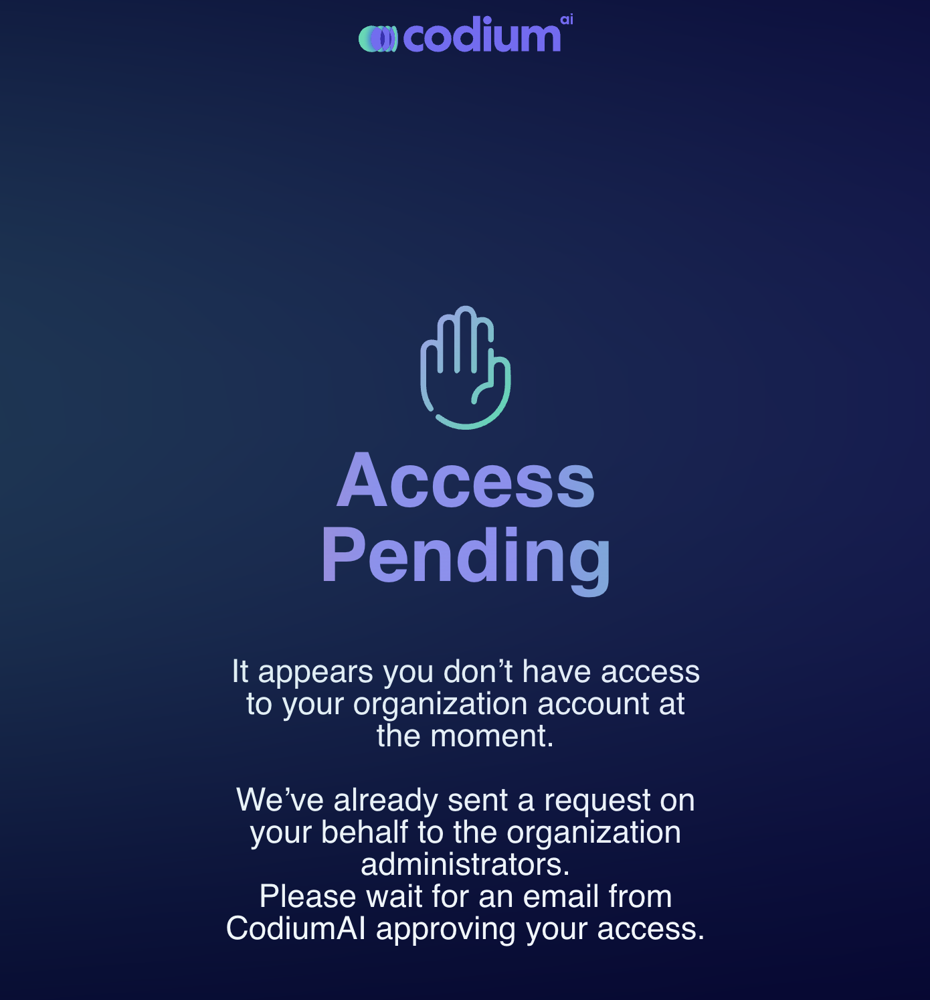
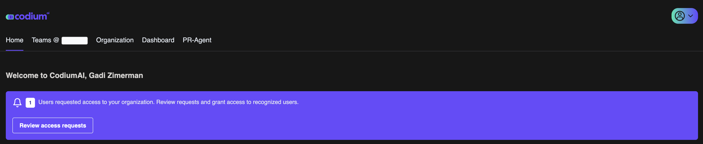

# Organization Administrators

## Invite only enterprise

Invite-only members are users who are only considered part of the organization once they receive and accept an invitation. Users do not automatically become members, but they become exclusively associated with the organization through an invitation process. This approach allows the organization to maintain tighter control over who can join and access its resources.

### Pending Status

After the invitation is sent, these users are  marked with an "Access Pending" status until they accept the invitation. 

### Controlled Access

 Admins can manage who gets invited, allowing for controlled and secure access to the organization's resources. Once an invitation is pending, the admin will receive a notification in the dashboard.

