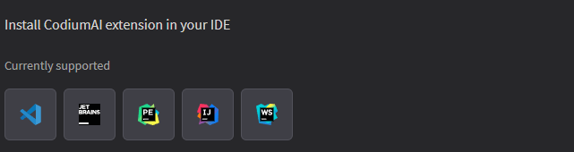
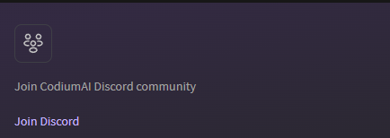
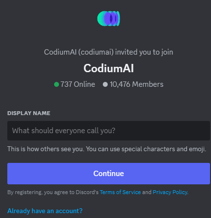
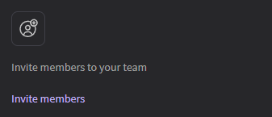
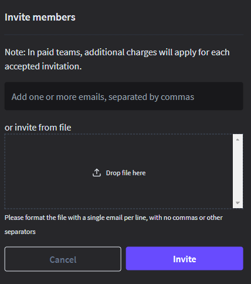

## Portal as individual

Once you have successfully logged in, you will be directed to the Qodo
Dashboard. The dashboard offers the following features:

-   Install qodo Gen extension in your IDE

-   Connect qodo Merge to repositories,

-   Invite members to join dIscord community, and

-   Invite team members to join your team.

## Install qodo Gen Extension for Supported IDEs 

1.  On the dashboard, locate the "Extensions" tab or section. A list of
    supported IDEs (Integrated Development Environments) will be displayed.

2.  Select your preferred IDE from the list (e.g., Visual Studio Code, IntelliJ
    IDEA, etc.).

3.  Follow the on-screen instructions to download and install the qodo Gen
    extension for the selected IDE.

4.  Once installed, the extension will enhance your IDE with qodo Gen's features.

## Join Qodo Discord Community

1.  On the dashboard, locate and click on the "**Join Discord**" link. The
    discord homepage will be displayed.

2.  Enter the Display name and click **Continue**.

## Invite Members

1.  On the dashboard, locate and click on the "**Invite Member**" link. The invite member page will be displayed.  

    

2.  Enter the email addresses of the individuals you wish to invite to the Qodo community.

3.  It is also possible to extend an invitation to members from the file. To
    invite members from a file, simply place the file in the "**Drop file
    here**" position.

4.  Click " **Invites**" to dispatch the invitations.

