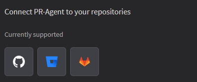
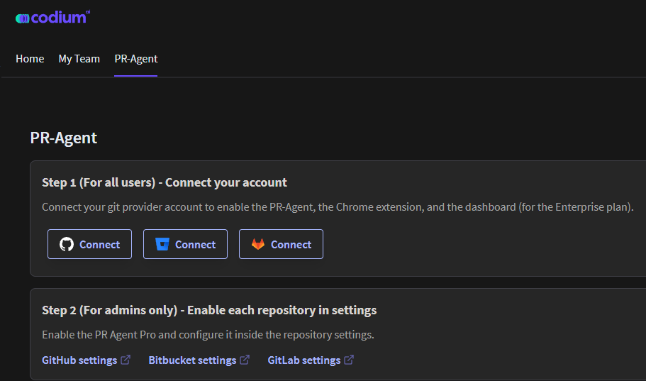

## Connect PR-Agent to Your Repository

1.  On the dashboard, locate the "Connect PR-Agent" tab or section. A list of
    supported repositories will be displayed.

2.  Choose your repository hosting service (e.g., GitHub, GitLab, Bitbucket). The PR-agent window will be displayed.

    

3.  Click on the "Connect" button. Authenticate and authorize Codium to connect
    your repository.

4.  Configure the PR (Pull Request) agent settings as needed. For more information, refer to  [(https://codium-ai.github.io/docs/pragent/)](https://codium-ai.github.io/docs/pragent/) 

