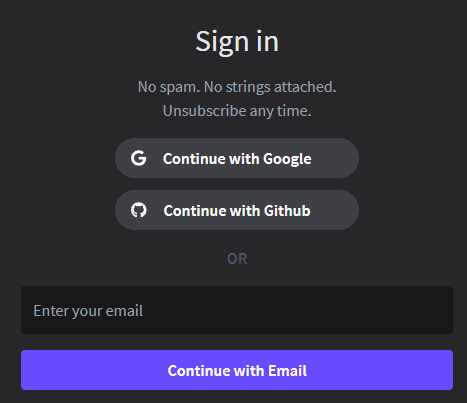
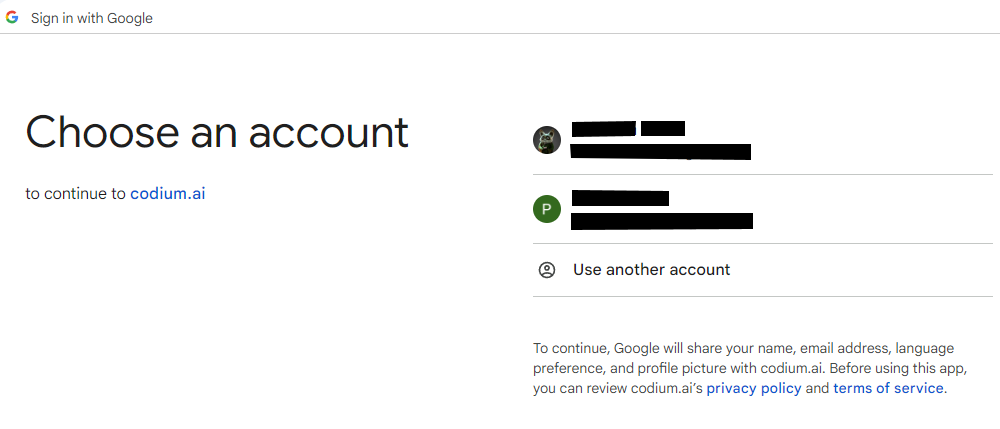
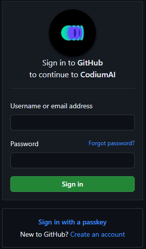
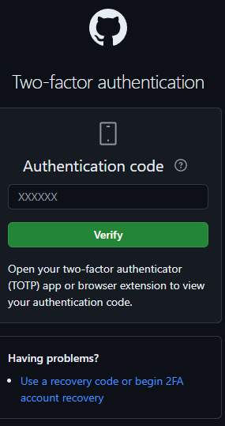
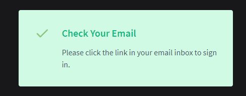
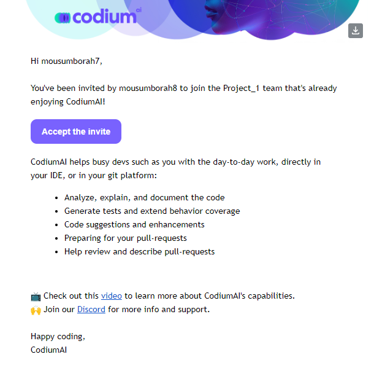
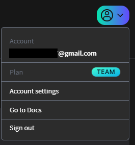

## Sign Up

To sign up, follow the steps outline below:

### Step 1: Access the Sign Up page

Open your web browser and navigate to the codium sign-in page [(https://app.codium.ai/signin)](https://app.codium.ai/signin) 

### Step 2: Choose Your Sign Up Method

On the sign up page, you will be presented with three options for signing up:

1. [Sign up with Google]() 

2. [Sign up with Github]() 

3. [ Sign up with Email]() 

 

#### Sign up with Google

1. Click on the "**Continue with Google**" button. You will be redirected to Google's login page.

 

2. Choose an account or use your google email and password.

3. You will be redirected back to the portal with your Google account linked.

#### Sign up with Github

1.  Click on the "**Continue with GitHub**" button. You will be redirected to
    GitHub's login page.  

     

2.  Enter your GitHub username and password, then click "**Sign in**".

3.  Authorize the application by clicking "Authorize" if prompted.  

     

4.  You will be redirected back to the portal with your GitHub account linked.

#### Sign up with Email

1.  Click on the "**Contuine with Email**" button. Enter a valid email address. Check your email for a verification link sent by the portal.  

     

2.  Click the verification link to activate your account.

## Accepting an Invitation to join CodiumAI

1.  Open your email inbox associated with the invitation. Look for an email from
    Codium with the subject line "**Join your team - enjoy CodiumAI**".

2.  Inside the email, locate and click on the "**Accept the Invite**" button.
    This will redirect you to the Codium login
  
    

3.  Enter the same email address that received the invitation.

4.  Click the "**Continue with email**" button to access your Codium account. Click the **Login** button to access your Codium account.

## Account Settings

The account settings enable you to edit your account details, as well as other account-related actions such as visiting the documentation section and deleting your account.

To access the account settings, click on the profile icon located the upper right corner of the screen. A dropdown menu will appear providing the following options:

-   **Account Name**: View and edit your account name.

-   **Plan Activate**: View details about your current plan.

-   **Account Settings**: Access and edit detailed account settings.

-   **Go to Docs**: Visit the documentation section.

-   **Sign Out**: Sign out of your Codium account.

     
