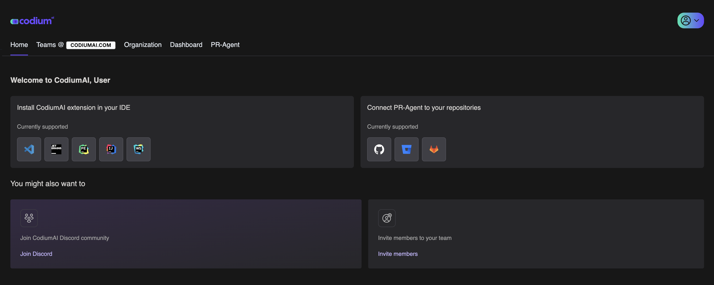

# Welcome to the Management Portal Documentation

<h3 class="black" markdown>
**Manage and get insights for your account, team, or organization.**
</h3>

Welcome to Qodo's Insight-Agent, designed to:

- Enhance your interaction with other agents.
- Gain important insights and metrics on your team's software development.
- **[TBD]** Get a clear ROI view of your usage of Qodo's agent suite.

## Getting started

Go to your management portal at [**app.qodo.ai**](https://app.qodo.ai/)

Alternatively, you can access the portal from qodoMate: click the three dots at the top-right of the extension, then choose User Portal.

-  __VSCode__ 

    [:octicons-arrow-right-24: Install qodoMate extension for VSCode](https://marketplace.visualstudio.com/items?itemName=Codium.codium)

- :simple-jetbrains: __JetBrains__ 
    
    [:octicons-arrow-right-24: Install qodoMate plugin for all JetBrains IDEs](https://plugins.jetbrains.com/plugin/21206-codiumate--code-test-and-review-with-confidence--by-codiumai)

## Main capabilities

qodoMate's User Portal comes packed with features to enhance every step of your development cycle:

| Method      | Description                          |
| ----------- | ------------------------------------ |
| **[Manage Account](./developer-and-teams-member/index.md)**  | TBD |
| **[Manage Teams & Roles](./teams-admin/index.md)** | Upgrade your account to gain access to premium features, Edit account details and payment methods, and view invoices. |
| **[Manage Organizations & Roles](./enterprise-admin/index.md)** | TBD Manage enterprise features. |
| **[Get Insights](./enterprise-admin/dashboard)** | Get statistics of usage and tools ROI on the individual, team, and organization levels [Currently available for Enterprise plan only, coming soon to all other plans]. |
| **[Connect your PR-Agent Pro](./general/pr-agent)** | Get the best PR review tool by connecting your git provider and Qodo accounts. |

## The Home Tab

  

## Join the community

If you need assistance or have questions about The Management Portal, feel free to email us at **<support@qodo.ai>**  or join our [**Discord community**](https://discord.com/invite/kG35uSHDBc).

<h3 class="black" markdown>
**Welcome aboard and happy coding!**
</h3>