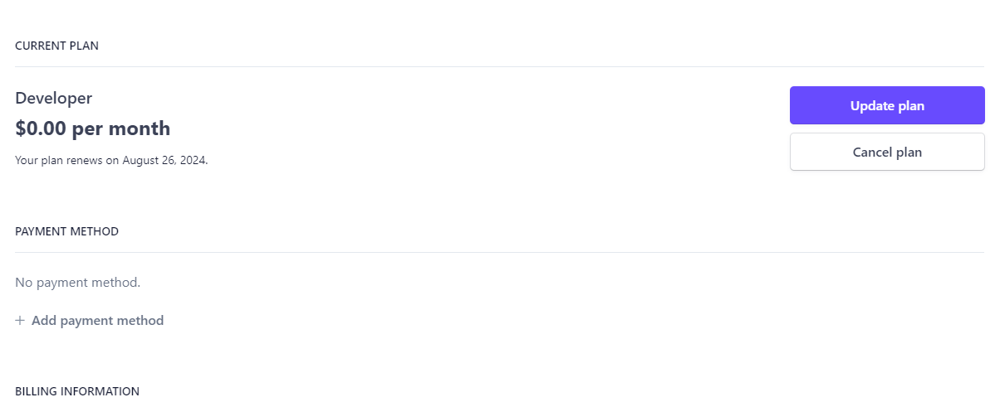
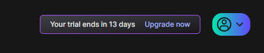
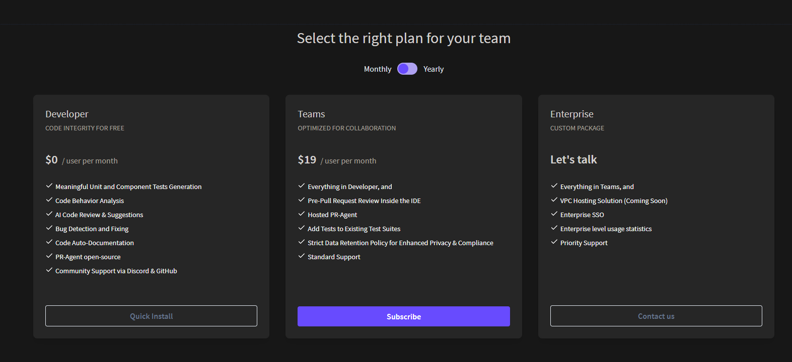
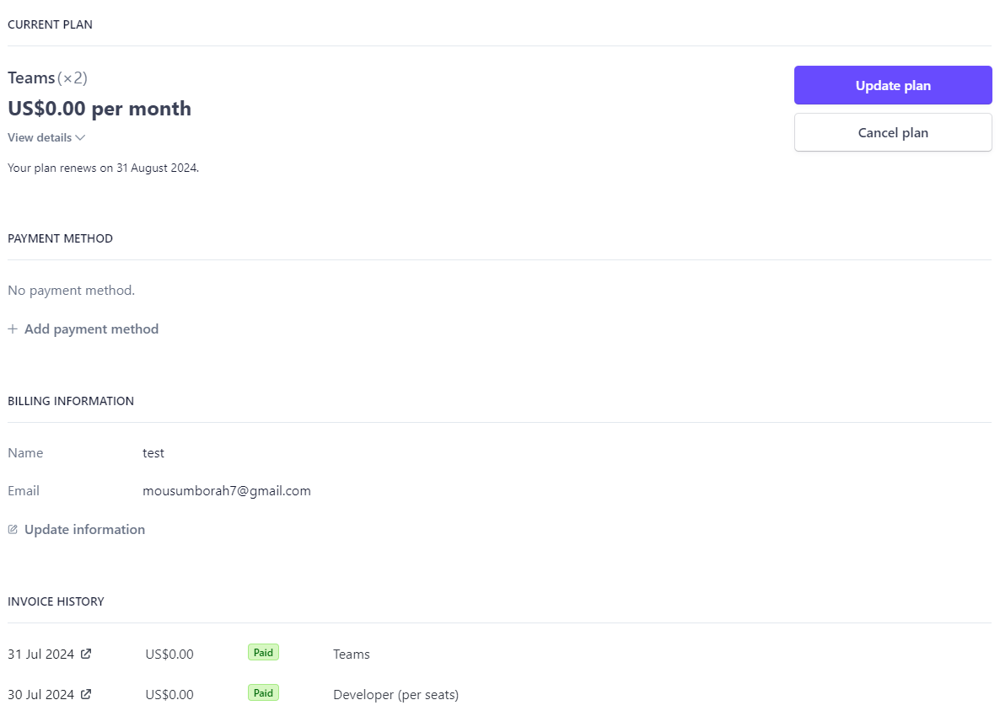
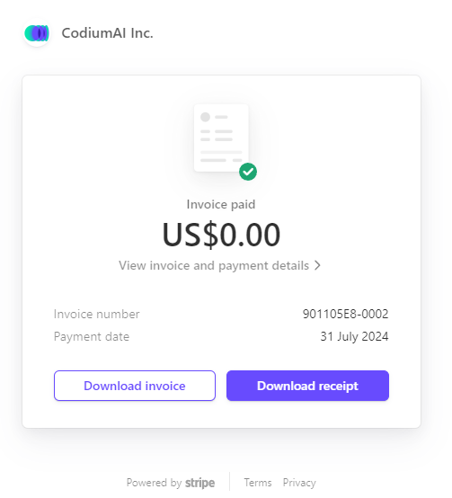
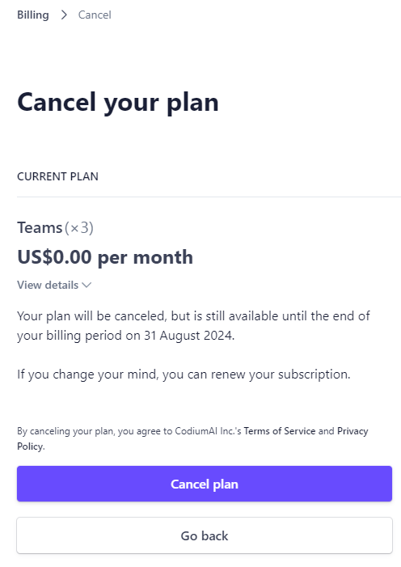
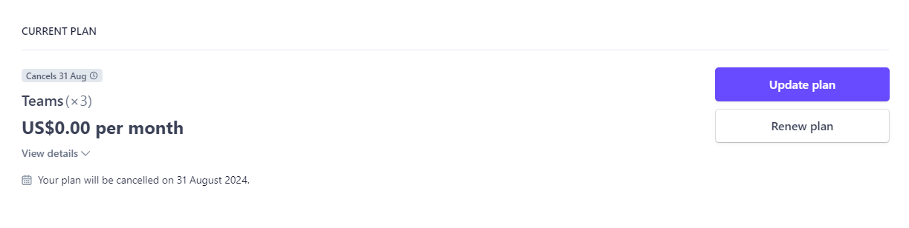

# Manage Teams' Plan

#### Manage Plan

In the dropdown menu under "Manage Team," select "Manage Plan" to adjust your
team’s subscription or plan details.

## Upgrading plan

To ensure your team has access to the best features and resources Codium has to
offer, you can upgrade your existing plan easily. Follow the steps below to
upgrade your plan.

1.  Click on the "Upgrade Now" button located at the top upper corner of the
    dashboard.  

    

2.  Review the available plans (Developer, Teams, Enterprise) and select the one
    that best suits your team’s needs.  

    

3.  Click the "Subscibe" button to start the upgrade process.

## Invoice History

You can easily access and manage your invoices on Codium, To manage invoices,
follow the steps outline below:

1.  Click the "**Manage Team**" button located in the upper right corner of each
    team.
    
    

2.  Select "**Manage Plan**" to view your team’s subscription or plan
    details.
    
    

3.  Scroll down to the end of the Plan section to view the **INVOICE HISTORY**
    section where you can view the status of your invoices (paid or unpaid).

4.  In the **INVOICE HISTORY** section, find the invoice you wish to view.

5.  Click on the **Download Invoice** or **Download Receipt** Receipt button next to the
    invoice. The invoice will be downloaded as a PDF
    file.
    
    

## Cancel Subscription

To cancel an existing subscription, Follow the steps outline below:

1.  In your team’s subscription or plan details page, Click the **Cancel Plan**
    Button.
    
    

2.  Review the information provided, including any details about the remaining
    subscription. Confirm your decision by clicking on **Cancel Plan**
    button.
    
    

3.  You will be asked to provide feedback on why you are cancelling. This step
    is optional.

4.  Ensure that your subscription status in the **Billing** section reflects the
    cancellation.
    
    
