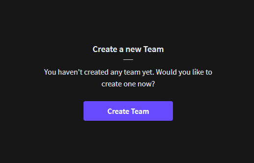
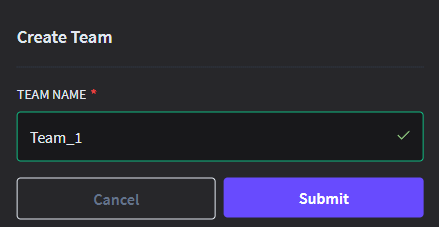
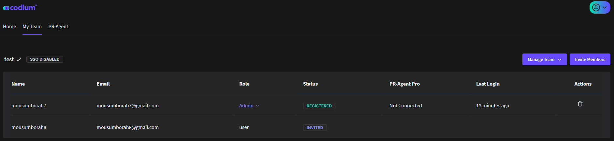
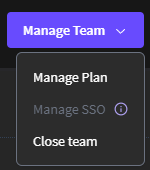
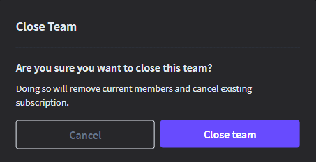
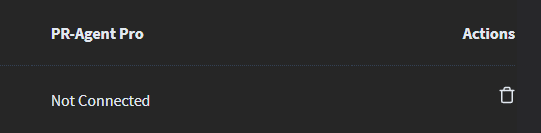
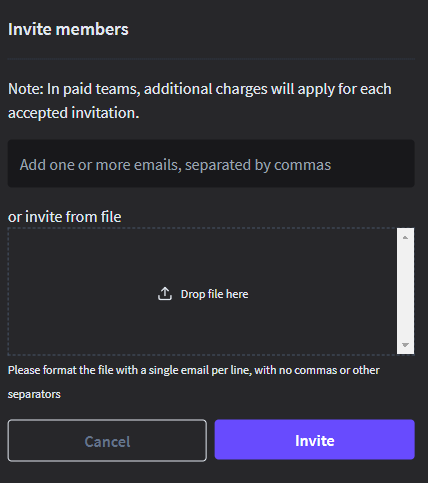

# Team Administrators Functionalities

### Creating a New Team

To create a new team:

1.  On the Qodo dashboard, select the "**My Team**" tab, then click on
    the "**Create Team**" button. 

    

2.  Enter your desired team name in the provided field.

3.  Click the "**Submit**" button to create your team.  

    

4.  The new team will be displayed in the board.  

    

## Managing Your Team

The manage team feature allows you to manage existing teams, manage plan, manage
SSO and close team. Click the "**Manage Team**" button located in the upper
right corner of each team.  

#### Close Team

To disband the team, select "Close Team" from the dropdown menu. Confirm your
action if prompted.

**Note**: Removing your team will remove current team members and terminate the
existing subscription.

## Removing Team Members

To remove a member from the team, click on the delete icon (trash can) located
to the right of the member’s name.

## Inviting Team Members

You can add new members to the team by inviting them. To invite an team member:

1.  In the "My Team" section, click on the "**Invite Member**" button. The invite
    member page will be displayed.  

    

2.  Enter the email addresses of the individuals you wish to invite to the
    Qodo community.

3.  It is also possible to extend an invitation to members from a file. To
    invite members from a file, simply place the file in the "**Drop file
    here**" position.

4.  Click "**Invites**" to dispatch the invitations.

