# Portal Admin user Guide
## Sign Up

To sign up, follow the steps outline below:

### Step 1: Access the Sign Up page

Open your web browser and navigate to the codium sign-in page [(https://app.codium.ai/signin)](https://app.codium.ai/signin) 

### Step 2: Choose Your Sign Up Method

On the sign up page, you will be presented with three options for signing up:

1. [Sign up with Google]() 

2. [Sign up with Github]() 

3. [ Sign up with Email]() 

 

#### Sign up with Google

1. Click on the "**Continue with Google**" button. You will be redirected to Google's login page.

 

2. Choose an account or use your google email and password.

3. You will be redirected back to the portal with your Google account linked.

#### Sign up with Github

1.  Click on the "**Continue with GitHub**" button. You will be redirected to
    GitHub's login page.  

     

2.  Enter your GitHub username and password, then click "**Sign in**".

3.  Authorize the application by clicking "Authorize" if prompted.  

     

4.  You will be redirected back to the portal with your GitHub account linked.

#### Sign up with Email

1.  Click on the "**Contuine with Email**" button. Enter a valid email address. Check your email for a verification link sent by the portal.  

    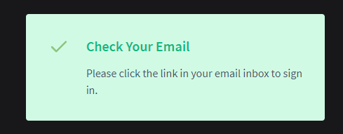 

2.  Click the verification link to activate your account.

## Account Settings

The account settings enable you to edit your account details, as well as other account-related actions such as visiting the documentation section and deleting your account.

To access the account settings, click on the profile icon located the upper right corner of the screen. A dropdown menu will appear providing the following options:

-   **Account Name**: View and edit your account name.

-   **Plan Activate**: View details about your current plan.

-   **Account Settings**: Access and edit detailed account settings.

-   **Go to Docs**: Visit the documentation section.

-   **Sign Out**: Sign out of your Codium account.

     

## Portal as individual

Once you have successfully logged in, you will be directed to the Codium
Dashboard. The dashboard offers the following features:

-   Install CodiumAI extension in your IDE

-   Connect PR-agents to repositories,

-   Invite members to join dIscord community, and

-   invitie team members to join your team.

## Install Codium Extension for Supported IDEs 

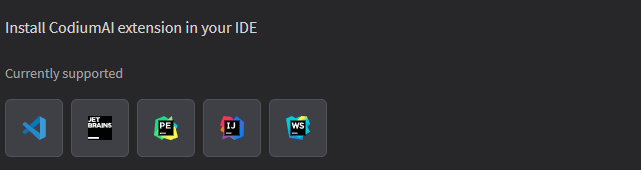

1.  On the dashboard, locate the "Extensions" tab or section. A list of
    supported IDEs (Integrated Development Environments) will be displayed.

2.  Select your preferred IDE from the list (e.g., Visual Studio Code, IntelliJ
    IDEA, etc.).

3.  Follow the on-screen instructions to download and install the Codium
    extension for the selected IDE.

4.  Once installed, the extension will enhance your IDE with Codium's features.

## Connect PR-Agent to Your Repository

1.  On the dashboard, locate the "Connect PR-Agent" tab or section. A list of
    supported repositories will be displayed.

2.  Choose your repository hosting service (e.g., GitHub, GitLab, Bitbucket). The PR-agent window will be displayed.

    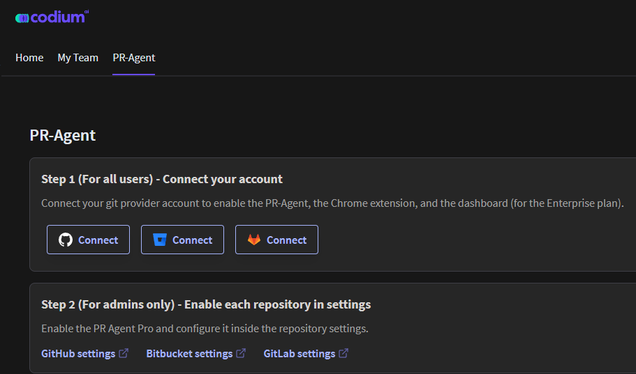

3.  Click on the "Connect" button. Authenticate and authorize Codium to connect
    your repository.

4.  Configure the PR (Pull Request) agent settings as needed. For more information, refer to  [(https://codium-ai.github.io/docs/pragent/)](https://codium-ai.github.io/docs/pragent/) 

## Join CodiumAI Discord Community

1.  On the dashboard, locate and click on the "**Join Discord**" link. The
    discord homepage will be displayed.

2.  Enter the Display name and click **Continue**.

## Invite Members

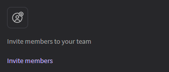

1.  On the dashboard, locate and click on the "**Invite Member**" link. The invite member page will be displayed.  

    

2.  Enter the email addresses of the individuals you wish to invite to the Codium community.

3.  It is also possible to extend an invitation to members from the file. To
    invite members from a file, simply place the file in the "**Drop file
    here**" position.

4.  Click " **Invites**" to dispatch the invitations.

## Managing Your Team in Codium

The "My Team" section in Codium allows you to create new teams, manage existing
teams, and invite team members.

### Creating a New Team

To create a new team, follow the steps outline below:

1.  On the Codium dashboard, locate and click on the "**My Team**" tab. Click on
    the "**Create Team**" button.  

    

2.  Enter your desired team name in the provided field.

3.  Click the "**Submit**" button to create your team.  

    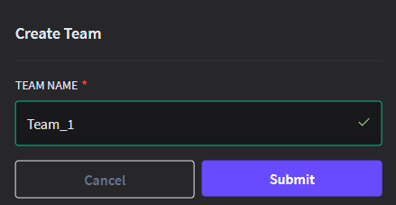

4.  The new team will be displayed in the board.  

    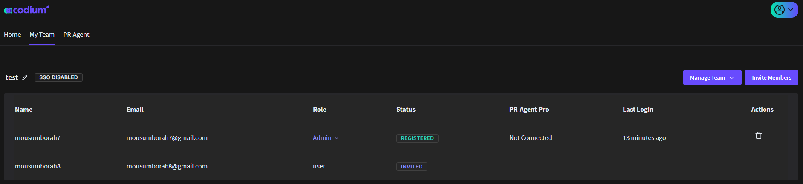

5.  To move between the teams, click the team's dropdown menu.
 
     

## Managing Your Team

The manage team feature allows you to manage existing teams, manage plan, manage environment, manage SSO  and close team. Click the **Manage Team** button located in the upper right corner of each team. 

#### Manage Enviroment

In the Enviroment, you can select the different environment for your team.

#### Manage Plan

In the dropdown menu under "Manage Team," select "Manage Plan" to adjust your team’s subscription or plan details.

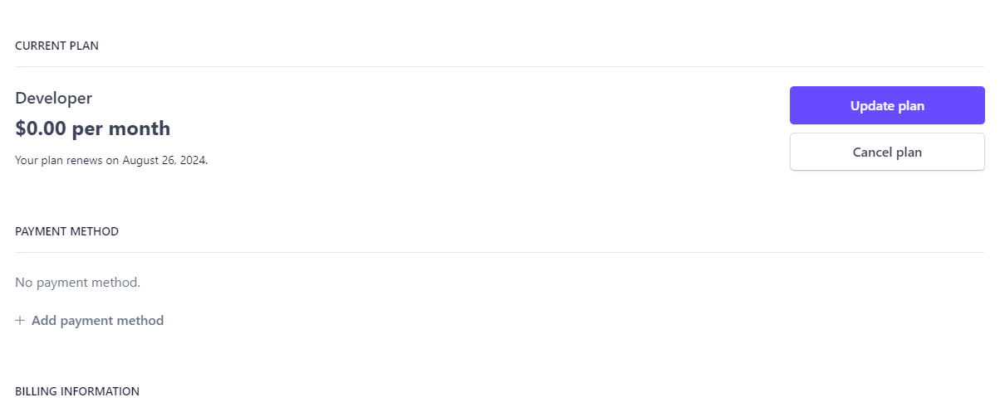

#### Close Team

To disband the team, select "Close Team" from the dropdown menu. Confirm your
action if prompted.

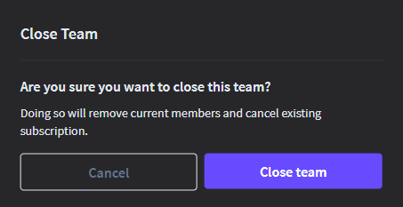

**Note**: Removing your team will remove current team members and terminate the
existing subscription.

## Removing Team Members

To remove a member from the team, click on the delete icon (trash can) located
to the right of the member’s name.

## Inviting Team Members

You can add new members to the team by inviting them. To invite an team member,
follow the steps outline below:

1.  In the "My Team" section, click on the "**Invite Member**" button.The invite
    member page will be displayed.  

    

2.  Enter the email addresses of the individuals you wish to invite to the
    Codium community.

3.  It is also possible to extend an invitation to members from the file. To
    invite members from a file, simply place the file in the "**Drop file
    here**" position.

4.  Click " **Invites**" to dispatch the invitations.

## Upgrading plan

To ensure your team has access to the best features and resources Codium has to
offer, you can upgrade your existing plan easily. Follow the steps below to
upgrade your plan.

1.  Click on the "Upgrade Now" button located at the top upper corner of the
    dashboard.  

    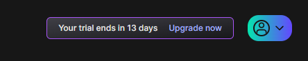

2.  Review the available plans (Developer, Teams, Enterprise) and select the one
    that best suits your team’s needs.  

    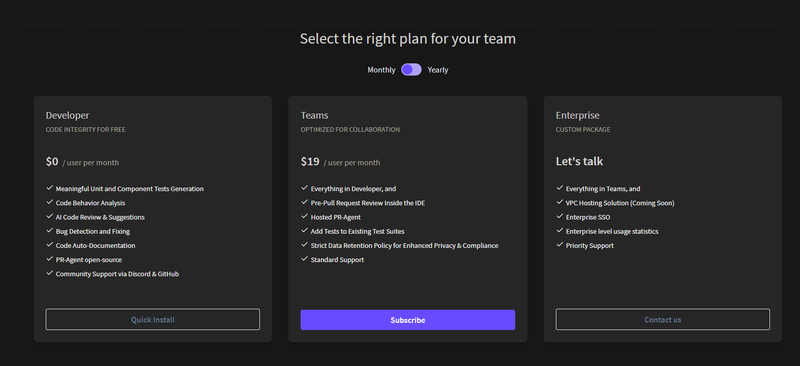

3.  Click the "Subscibe" button to start the upgrade process.

## Invoice History

You can easily access and manage your invoices on Codium, To manage invoices,
follow the steps outline below:

1.  Click the "**Manage Team**" button located in the upper right corner of each
    team.
    
    

2.  Select "**Manage Plan**" to view your team’s subscription or plan
    details.
    
    

3.  Scroll down to the end of the Plan section to view the **INVOICE HISTORY**
    section where you can view the status of your invoices (paid or unpaid).

4.  In the **INVOICE HISTORY** section, find the invoice you wish to view.

5.  Click on the **Download Invoice** or **Download Receipt** Receipt button next to the
    invoice. The invoice will be downloaded as a PDF
    file.
    
    

## Cancel Subscription

To cancel an existing subscription, Follow the steps outline below:

1.  In your team’s subscription or plan details page, Click the **Cancel Plan**
    Button.
    
    

2.  Review the information provided, including any details about the remaining
    subscription. Confirm your decision by clicking on **Cancel Plan**
    button.
    
    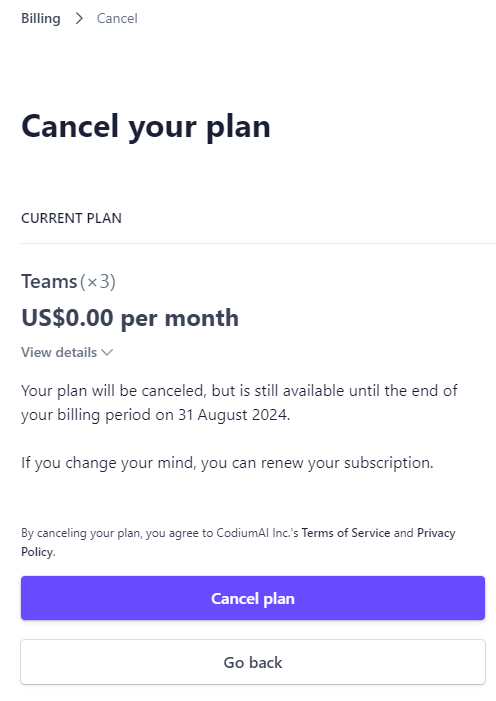

3.  You will be asked to provide feedback on why you are cancelling. This step
    is optional.

4.  Ensure that your subscription status in the **Billing** section reflects the
    cancellation.
    
    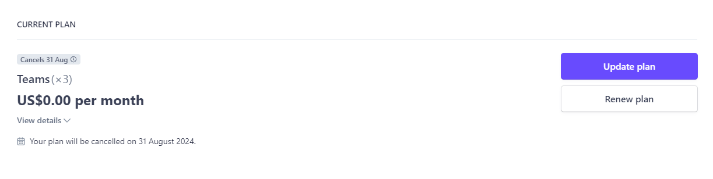

## Organization

**Organization** tab in Codium enable you can manage users, assign roles, and configure environments.

### Invite Member

1.  On the dashboard, locate and click on the "**Invite Member**" link. The invite member page will be displayed.  

    

2.  Enter the email addresses of the individuals you wish to invite to the Codium community.

3.  It is also possible to extend an invitation to members from the file. To invite members from a file, simply place the file in the "**Drop file here**" position.

4.  Click " **Invites**" to dispatch the invitations.

### Add and Manage Member

Once added, you can assign roles to each user:

-   **Team Role:** Assign the user a role within a specific team (e.g., Admin or Member).

-   **Organization Role:** Set the user’s role within the organization as a whole (e.g., Admin or Member).

You can also check the status of each user

-   **Registered:** Indicates that the user has accepted the invitation and is part of the organization.

-   **Invited:** Indicates that the user has been invited but has not yet registered

    

### Select Environments

Within the **Organization** tab, you can select different environments for your users:

-   **SaaS:** Software-as-a-Service environment.

-   **Test AWS:** A testing environment on Amazon Web Services.

-   **JetBrains:** Integrated development environments (IDEs) by JetBrains.

-   **Own AWS:** A custom Amazon Web Services environment.

Assign specific environments to users based on their roles and needs.

## Managing the Organization

Within the **Organization** tab, select the **Manage Organization** dropdown menu. This dropdown provides the following options:  

-   **Create a Team:**

    -   Select this option to create a new team within your organization.

    -   You can name the team and assign team

        

-   **Manage Environment:**

    -   Use this option to manage and configure the different environments
        available in your organization.

    -   Create new environments to teams or individual users as needed.

        

-   **Manage SSO:**

    -   Single Sign-On (SSO) management allows you to configure and control
        access to your organization using SSO settings.

    -   Ensure that SSO settings align with your organization’s security
        policies.

## Dashboard

This section provides high-level summary metrics that give a quick snapshot of
overall performance. It may include metrics such as number of active user, Trigger per day etc.

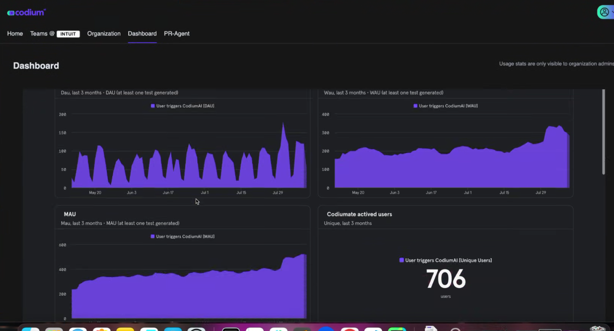

## Invite only enterprise

Invite-only members are users who are only considered part of the organization once they receive and accept an invitation. Users do not automatically become members, but they become exclusively associated with the organization through an invitation process. This approach allows the organization to maintain tighter control over who can join and access its resources.

### Pending Status

After the invitation is sent, these users are  marked with an "Access Pending" status until they accept the invitation. 

### Controlled Access

 Admins can manage who gets invited, allowing for controlled and secure access to the organization's resources. Once an invitation is pending, the admin will receive a notification in the dashboard.

