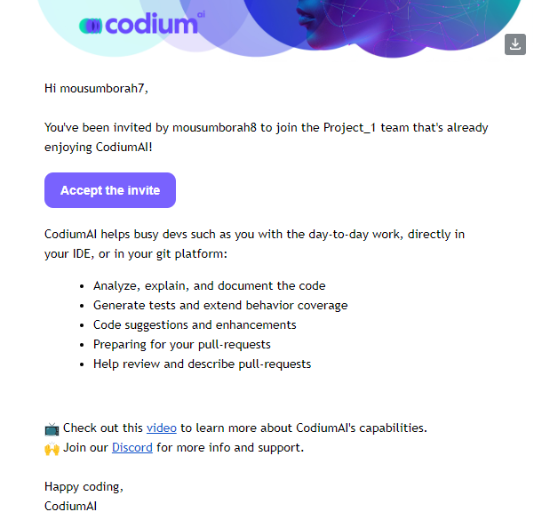
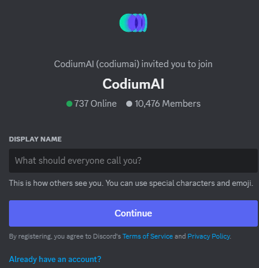
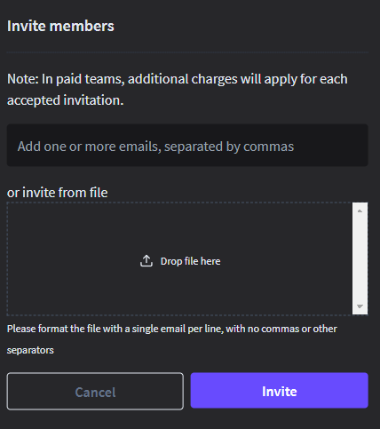

# Portal User Guide
## Sign Up

To sign up, follow the steps outline below:

### Step 1: Access the Sign Up page

Open your web browser and navigate to the codium sign-in page [(https://app.codium.ai/signin)](https://app.codium.ai/signin) 

### Step 2: Choose Your Sign Up Method

On the sign up page, you will be presented with three options for signing up:

1. [Sign up with Google]() 

2. [Sign up with Github]() 

3. [ Sign up with Email]() 

 

#### Sign up with Google

1. Click on the "**Continue with Google**" button. You will be redirected to Google's login page.

 

2. Choose an account or use your google email and password.

3. You will be redirected back to the portal with your Google account linked.

#### Sign up with Github

1.  Click on the "**Continue with GitHub**" button. You will be redirected to
    GitHub's login page.  

     

2.  Enter your GitHub username and password, then click "**Sign in**".

3.  Authorize the application by clicking "Authorize" if prompted.  

     

4.  You will be redirected back to the portal with your GitHub account linked.

#### Sign up with Email

1.  Click on the "**Contuine with Email**" button. Enter a valid email address. Check your email for a verification link sent by the portal.  

     

2.  Click the verification link to activate your account.

## Accepting an Invitation to join Codium

1.  Open your email inbox associated with the invitation. Look for an email from
    Codium with the subject line "**Join your team - enjoy CodiumAI**".

2.  Inside the email, locate and click on the "**Accept the Invite**" button.
    This will redirect you to the Codium login
  
    

3.  Enter the same email address that received the invitation.

4.  Click the "**Continue with email**" button to access your Codium account. Click the **Login** button to access your Codium account.

## Account Settings

The account settings enable you to edit your account details, as well as other account-related actions such as visiting the documentation section and deleting your account.

To access the account settings, click on the profile icon located the upper right corner of the screen. A dropdown menu will appear providing the following options:

-   **Account Name**: View and edit your account name.

-   **Plan Activate**: View details about your current plan.

-   **Account Settings**: Access and edit detailed account settings.

-   **Go to Docs**: Visit the documentation section.

-   **Sign Out**: Sign out of your Codium account.

     

## Portal as individual

Once you have successfully logged in, you will be directed to the Codium
Dashboard. The dashboard offers the following features:

-   Install CodiumAI extension in your IDE

-   Connect PR-agents to repositories,

-   Invite members to join dIscord community, and

-   invitie team members to join your team.

## Install Codium Extension for Supported IDEs 

1.  On the dashboard, locate the "Extensions" tab or section. A list of
    supported IDEs (Integrated Development Environments) will be displayed.

2.  Select your preferred IDE from the list (e.g., Visual Studio Code, IntelliJ
    IDEA, etc.).

3.  Follow the on-screen instructions to download and install the Codium
    extension for the selected IDE.

4.  Once installed, the extension will enhance your IDE with Codium's features.

## Connect PR-Agent to Your Repository

1.  On the dashboard, locate the "Connect PR-Agent" tab or section. A list of
    supported repositories will be displayed.

2.  Choose your repository hosting service (e.g., GitHub, GitLab, Bitbucket). The PR-agent window will be displayed.

    

3.  Click on the "Connect" button. Authenticate and authorize Codium to connect
    your repository.

4.  Configure the PR (Pull Request) agent settings as needed. For more information, refer to  [(https://codium-ai.github.io/docs/pragent/)](https://codium-ai.github.io/docs/pragent/) 

## Join CodiumAI Discord Community

1.  On the dashboard, locate and click on the "**Join Discord**" link. The
    discord homepage will be displayed.

2.  Enter the Display name and click **Continue**.

## Invite Members

1.  On the dashboard, locate and click on the "**Invite Member**" link. The invite member page will be displayed.  

    

2.  Enter the email addresses of the individuals you wish to invite to the Codium community.

3.  It is also possible to extend an invitation to members from the file. To
    invite members from a file, simply place the file in the "**Drop file
    here**" position.

4.  Click " **Invites**" to dispatch the invitations.

## Managing Your Team in Codium

As a team member, you do not have the authority to manage any team. You can only view the team you are part of. However, the admin can grant you administrative rights if needed.

## Removing Team Members

To remove a member from the team, click on the delete icon (trash can) located to the right of the member’s name.

